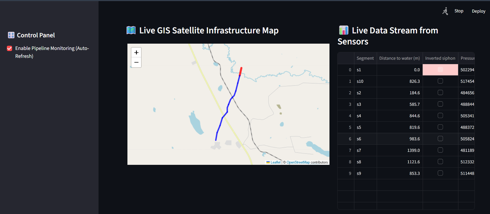

# Pipeline Digital Twin Monitoring with Kafka & PostGIS

A geospatial Digital Twin prototype that simulates real-time pipeline monitoring using **Kafka**, **PostGIS**, and **Python**.

The project demonstrates how streaming IoT sensor data can be combined with spatial analysis to identify pipeline segments that require attention based on environmental conditions and simulated sensor measurements.

---

## Project Overview

This project simulates a simplified pipeline monitoring system:

- Pipeline geometry is stored in **PostGIS**
- Pipeline is divided into segments
- A Kafka producer continuously generates sensor readings
- A Kafka consumer processes incoming events
- Data is written back to PostgreSQL/PostGIS
- A live dashboard displays the current state of the pipeline

The goal is to demonstrate a realistic geospatial data pipeline rather than build a production-ready SCADA system.

---

## Architecture

```
Pipeline Geometry
       │
       ▼
  PostGIS Database
       │
       ▼
Geometry Initialization
       │
       ▼
Kafka Producer
(Simulated Sensors)
       │
       ▼
Kafka Topic
       │
       ▼
Kafka Consumer
       │
       ▼
PostGIS
       │
       ▼
Live Dashboard
```

---

## Features

- Real-time IoT sensor simulation
- Apache Kafka message streaming
- Spatial data storage with PostGIS
- Pipeline segmentation
- Live monitoring dashboard
- Randomized pressure, temperature and vibration values
- Alert-ready architecture for future extensions

---

## Technologies

- Python
- PostgreSQL
- PostGIS
- Apache Kafka
- psycopg2
- pandas
- matplotlib

---

## Project Structure

```
.
├── geometry_init.py      # Creates pipeline geometry and segments
├── producer.py           # Simulates IoT sensor data
├── sensor_consumer.py    # Consumes Kafka messages and updates database
├── dashboard.py          # Live monitoring dashboard
└── README.md
```

---

# Workflow

1. Initialize the pipeline geometry.
2. Store pipeline segments in PostGIS.
3. Start Kafka.
4. Run the producer to generate sensor data.
5. Run the consumer to process messages.
6. Launch the dashboard for real-time visualization.

---

# Dashboard




---

# Example Sensor Data

| Timestamp | Segment | Pressure | Temperature | Vibration |
|-----------|---------|----------|-------------|-----------|
| 2026-07-12 14:03 | 15 | 71.3 psi | 24.5°C | 0.18 |
| 2026-07-12 14:04 | 16 | 74.1 psi | 25.2°C | 0.15 |
| 2026-07-12 14:05 | 17 | 89.8 psi | 30.1°C | 0.46 |

---

# Future Improvements

- MQTT integration
- Real sensor devices
- WebSocket streaming
- Docker Compose deployment
- Grafana monitoring
- Automatic anomaly detection
- Interactive web map (Leaflet/Folium)

---

# Purpose

This project was created as a portfolio project to demonstrate practical skills in:

- GIS development
- Spatial databases
- Real-time data streaming
- Python backend development
- Geospatial analytics

---

## Author

**Madina Temirova**

GIS Developer | Python | PostGIS | Kafka